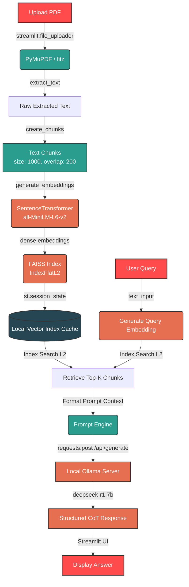

# 📄 LocalPDF-QA: Fully Private Offline RAG Pipeline with DeepSeek-R1 & FAISS

[](https://www.python.org/)
[](https://streamlit.io/)
[](https://ollama.com/)
[](https://github.com/facebookresearch/faiss)
[](https://opensource.org/licenses/MIT)

A high-performance, 100% private, local Retrieval-Augmented Generation (RAG) system for question answering on PDF documents. Built from first principles without heavy frameworks (like LangChain or LlamaIndex) to maximize execution speed, transparency, and architectural control.

---

## 📌 Problem Statement

1. **Data Privacy**: Enterprise and personal documents (financial statements, medical records, research drafts) contain sensitive data that should never leave local storage or be uploaded to third-party APIs (such as OpenAI or Anthropic).
2. **Cost & Reliability**: Relying on subscription-based API tokens makes projects expensive at scale and prone to API downtime or latency spikes.
3. **Framework Bloat**: Modern RAG orchestrators (LangChain, LlamaIndex) introduce heavy dependencies, high runtime overhead, and complex abstractions that obscure the inner workings of vector search and prompt formatting.

---

## 💡 Solution Approach

This project implements a **zero-cloud-dependency, lightweight local RAG engine** from scratch:
* **Extraction**: Text is extracted locally from PDFs using the lightning-fast `PyMuPDF` library.
* **Semantic Chunking**: A custom overlapping character-based sliding window divides the document into semantic fragments.
* **Embeddings**: Local sentence embeddings are computed using Hugging Face's `all-MiniLM-L6-v2` transformer model (384 dimensions) running locally via `SentenceTransformers`.
* **Indexing & Retrieval**: Sub-millisecond similarity search is performed using the raw `FAISS` (Facebook AI Similarity Search) C++ API wrapper via `numpy`, using L2 Euclidean Distance.
* **Generation**: Context is injected into an offline prompt and sent to a locally-hosted `deepseek-r1:7b` model running on `Ollama`, leveraging its native reasoning/CoT (Chain-of-Thought) outputs.

---

## ⚡ Key Features

* 🔒 **100% Private & Local**: Fully offline execution. No telemetry, no API keys, and no network traffic outside your local machine.
* 🚀 **Zero-Bloat Custom RAG**: Built directly on top of raw Python, FAISS, and NumPy. Avoids LangChain wrappers, achieving faster startup and simplified debugging.
* 🧠 **Reasoning LLM (DeepSeek-R1)**: Harnesses local reasoning models to extract context, structure explanations, and avoid hallucinations (enforced by strict prompt constraints).
* 🔄 **Session-State Caching**: Streamlit caches document extraction, chunk embeddings, and the FAISS index to support multiple queries on a single document upload without recomputation.
* 📊 **Dual-Execution Mode**: Streamlit GUI for interactive user QA and a programmatic pipeline for automated text parsing and testing.
* 🧪 **Granular Test Suite**: Independent integration tests cover every component, from PDF parsing to similarity ranking and LLM generation.

---

## 📐 System Architecture

The following diagram illustrates the flow of a document from file upload to similarity search and final answer generation:



---

## 🛠️ Tech Stack

* **Frontend**: [Streamlit](https://streamlit.io/) (Interactive web interface)
* **LLM Engine**: [Ollama](https://ollama.com/) running [DeepSeek-R1 (7B)](https://ollama.com/library/deepseek-r1)
* **Embedding Model**: [all-MiniLM-L6-v2](https://huggingface.co/sentence-transformers/all-MiniLM-L6-v2) (SentenceTransformers)
* **Vector Database**: [FAISS-CPU](https://github.com/facebookresearch/faiss) (Facebook AI Similarity Search)
* **PDF Parser**: [PyMuPDF](https://pymupdf.readthedocs.io/en/latest/) (fitz)
* **HTTP Client**: Standard `requests` library (low-overhead Ollama communication)

---

## 📥 Installation & Setup

### 1. Prerequisites
Ensure you have Python 3.9+ installed and Git available on your system.

### 2. Set Up Local LLM (Ollama)
1. Download and install **Ollama** from [ollama.com](https://ollama.com/).
2. Start the Ollama server (usually runs in the background on port `11434`).
3. Run the following command in your terminal to download the DeepSeek-R1 7B model:
   ```bash
   ollama pull deepseek-r1:7b
   ```

### 3. Clone Repository and Install Dependencies
1. Clone the project:
   ```bash
   git clone https://github.com/Itsshakthinathans/pdf-qa-system.git
   cd pdf-qa-system
   ```
2. Create and activate a virtual environment:
   ```bash
   # Windows
   python -m venv venv
   venv\Scripts\activate

   # Linux/macOS
   python3 -m venv venv
   source venv/bin/activate
   ```
3. Install dependencies:
   ```bash
   pip install -r requirements.txt
   ```

---

## 🚀 Usage Instructions

### Run the Interactive App
Start the Streamlit application:
```bash
streamlit run app.py
```
This opens the browser client (usually at `http://localhost:8501`). Drag and drop a PDF, type a question, and click **Ask** to retrieve context and generate local answers.

### Run Headless Pipeline (Programmatic / Automated Scripts)
To run the RAG pipeline end-to-end programmatically without the UI, you can use the newly added `ask_pdf_question` function:
```python
from qa_pipeline import ask_pdf_question

pdf_path = "data/pdfs/sample.pdf"
question = "What is reinforcement learning?"

answer = ask_pdf_question(pdf_path, question)
print(answer)
```

---

## 📂 Project Structure

```
pdf-qa-system/
├── .streamlit/
│   └── config.toml          # Streamlit server properties
├── data/
│   └── pdfs/
│       └── sample.pdf       # Test PDF for initial verification
├── modules/
│   ├── __init__.py
│   ├── chunker.py           # Overlapping sliding window text chunker
│   ├── embeddings.py        # HuggingFace transformer embeddings
│   ├── llm.py               # REST API connection to local Ollama
│   ├── pdf_loader.py        # PyMuPDF engine for text extraction
│   ├── retriever.py         # FAISS similarity search wrapper
│   └── vector_store.py      # FAISS index creation and instantiation
├── test/
│   ├── test_chunker.py      # PDF parsing and chunk length test
│   ├── test_embeddings.py   # Embedding tensor shape verification
│   ├── test_faiss.py        # Index capacity and load testing
│   ├── test_llm.py          # Local Ollama connection & response latency test
│   ├── test_pdf_loader.py   # PyMuPDF character extraction test
│   ├── test_pipeline.py     # End-to-end pipeline CLI run
│   └── test_retriever.py    # Semantic matching validation
├── .gitignore               # Configured to exclude environments and caches
├── app.py                   # Streamlit Frontend application
├── LICENSE                  # MIT License
├── qa_pipeline.py           # Core pipeline orchestration logic
└── requirements.txt         # Cleaned, lightweight project requirements
```

---

## 🧪 Testing

The repository contains an exhaustive test suite inside the `test/` directory. These tests run without mounting the Streamlit server. Run any individual test to check specific components:

```bash
# Verify local Ollama server response
python test/test_llm.py

# Run end-to-end question answering test on sample.pdf
python test/test_pipeline.py
```

---

## 🔮 Future Enhancements

* **Hybrid Search (Sparse + Dense)**: Combine FAISS semantic similarity with BM25 lexical keyword matching to retrieve domain-specific terms more accurately.
* **Recursive text-splitting**: Upgrade from sliding characters to recursive structure-aware splitters to avoid breaking sentences or formatting lists across chunks.
* **Source Citations**: Track metadata of chunks (such as page numbers) and highlight exactly where in the document the information was extracted.
* **Cross-Document QA**: Support creating unified FAISS indices across multiple uploaded PDFs.

---

## 🤝 Contributing

Contributions are welcome! Please follow these guidelines:
1. Fork the Project.
2. Create a Feature Branch (`git checkout -b feature/AmazingFeature`).
3. Commit your Changes (`git commit -m 'Add some AmazingFeature'`).
4. Push to the Branch (`git push origin feature/AmazingFeature`).
5. Open a Pull Request.

---

## 📄 License

Distributed under the MIT License. See [LICENSE](file:///e:/PDF_QA_DeepSeek/LICENSE) for more details.
